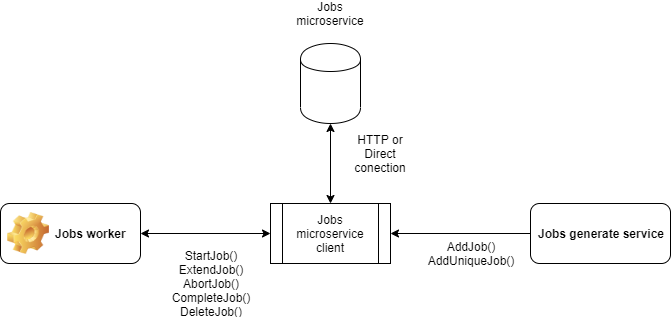

#  <br/> Jobs microservice

This is the jobs microservice. It keeps list of working jobs.

The service allows you to manage tasks in those cases when the generation (statement) of the task is performed in a separate microservice, and direct execution is implemented in one way or another.
One of the application options, see the following diagram:
</br>  </br>

To create a task, a simplified data model is used which should contain the following information:
- type - task type
- ref_id - identifier of the object on which the task will work
- ttl - the maximum lifetime of the task before its execution
- params - additional parameters necessary to complete the task

The created task is stored in the following form:
- id unique identifier
- type - task type
- ref_id - identifier of the object on which the task will work
- params - additional parameters necessary to complete the task
- created - time stamp for creating a task
- started - time stamp of the task start
- locked_until - task lock time stamp
- execute_until - time stamp of task execution restriction
- completed - time stamp for completing a task
- retries - number of starts

Task management is carried out through the API described below.

The microservice currently supports the following deployment options:
* Deployment platforms: Standalone Process
* External APIs: HTTP/REST
* Persistence: Memory, Flat Files, MongoDB

This microservice has no dependencies on other microservices.
<a name="links"></a> Quick Links:

* [Download Links](doc/Downloads.md)
* [Development Guide](doc/Development.md)
* [Deployment Guide](doc/Deployment.md)
* [Configuration Guide](doc/Configuration.md)
* Client SDKs
  - [Node.js SDK](https://github.com/pip-services-infrastructure2/client-jobs-node)
* Communication Protocols
  - [HTTP Version 1](doc/HttpProtocolV1.md)

##  Contract

Logical contract of the microservice is presented below. For physical implementation (HTTP/REST, Thrift, Seneca, Lambda, etc.),
please, refer to documentation of the specific protocol.

```typescript

class NewJobV1 {
    type: string;
    ref_id: string;
    ttl: number;
    params: any;
}

class JobV1 {
    id: string;
    type: string;
    ref_id: string;
    params: any;
    created: Date;
    started: Date;
    locked_until?: Date;
    execute_until?: Date;
    completed: Date;
    retries: number;
}

interface IJobsController {

    addJob(correlationId: string, newJob: NewJobV1): Promise<JobV1>;
    addUniqJob(correlationId: string, newJob: NewJobV1): Promise<JobV1>;
    getJobs(correlationId: string, filter: FilterParams, paging: PagingParams): Promise<DataPage<JobV1>>;
    getJobById(correlationId: string, jobId: string): Promise<JobV1>;
    startJobById(correlationId: string, jobId: string, timeout: number): Promise<JobV1>;
    startJobByType(correlationId: string, jobType: string, timeout: number): Promise<JobV1>;
    extendJob(correlationId: string, jobId: string, timeout: number): Promise<JobV1>;
    abortJob(correlationId: string, jobId: string): Promise<JobV1>;
    completeJob(correlationId: string, jobId: string): Promise<JobV1>;
    deleteJobById(correlationId: string, jobId: string): Promise<JobV1>;
    deleteJobs(correlationId: string): Promise<void>;
    cleanJobs(correlationId: string): Promise<void>;
}
```

## Download

Right now the only way to get the microservice is to check it out directly from github repository
```bash
git clone git@github.com:pip-services-infrastructure2/service-jobs-node.git
```

Pip.Service team is working to implement packaging and make stable releases available for your 
as zip downloadable archieves.

## Run

Add **config.yaml** file to the root of the microservice folder and set configuration parameters.
As the starting point you can use example configuration from **config.example.yaml** file. 

Example of microservice configuration
```yaml
{    
---
- descriptor: "pip-services-commons:logger:console:default:1.0"
  level: "trace"

- descriptor: "service-jobs:persistence:file:default:1.0"
  path: "./data/blobs"

- descriptor: "service-jobs:controller:default:default:1.0"
  options:
    clean_interval: 60000
    max_retries: 10

- descriptor: "service-jobs:service:commandable-http:default:1.0"
  connection:
    protocol: "http"
    host: "0.0.0.0"
    port: 3000
}
```
 
For more information on the microservice configuration see [Configuration Guide](doc/Configuration.md).

Start the microservice using the command:
```bash
node run
```

## Install

Add dependency to the client SDK into **package.json** file of your project
```typescript
{
    ...
    "dependencies": {
        ....
        "client-jobs-node": "^1.0.*",
        ...
    }
}
```

Then install the dependency using **npm** tool
```bash
# Install new dependencies
npm install

# Update already installed dependencies
npm update
```

## Use

Inside your code get the reference to the client SDK
```typescript
 import { JobsHttpClientV1 } from 'client-jobs-node';
```

Define client configuration parameters.

```typescript
// Client configuration
var httpConfig = ConfigParams.fromTuples(
    "connection.protocol", "http",
    "connection.host", "localhost",
    "connection.port", 3000
);
client.configure(httpConfig);
```

Instantiate the client and open connection to the microservice
```typescript
// Create the client instance
client = new JobsHttpClientV1();

// Connect to the microservice
await client.open(null);

// Work with the microservice
...
```
Now the client is ready to perform operations:

Add job:
```typescript 

const JOB1: NewJobV1 = {
    type: "t1",
    ref_id: "obj_0fsd",
    params: null,
    ttl:1000*60*60*3, // 3 hour
}; 

try {
    let job = await client.addJob("123", JOB1);
    console.dir('Job was created successfull');
} catch(err) {
    console.error('Can\'t create job!');
    console.error(err);
}

```

Add uniq job:
```typescript 

const JOB1: NewJobV1 = {
    type: "t1",
    ref_id: "obj_0fsd",
    params: null,
    ttl:1000*60*60*3, // 3 hour
}; 

const JOB2: NewJobV1 = {
    type: "t1",
    ref_id: "obj_0fsd",
    params: null,
    ttl: 1000*60*60 // 1 hour
};

try {
    let job = await client.addUniqJob("123", JOB1);
    // job variable was contained new job with JOB1 params
    console.dir('Job was created successfull');
} catch(err) {
    console.error('Can\'t create job!');
    console.error(err);
}

try {
    let job = await client.addUniqJob("123", JOB2);
    // job variable was contained new job with JOB1 params 
    console.dir('Job was created successfull');
} catch(err) {
    console.error('Can\'t create job!');
    console.error(err);
}
```

Get jobs by filter:
```typescript    
try {
    let page = await client.getJobs("123", new FilterParams(), new PagingParams());
    console.dir('Jobs was recived successfull');
    for (let job in page.data) {
        console.dir('Jobs:');
        console.dir(job.toString());
    }
} catch(err) {
    console.error('Can\'t get jobs!');
    console.error(err);
}

try {
    let page = await client.getJobs("123", FilterParams.fromTuples('lock', 'false' ),  new PagingParams());

    console.dir('Jobs was recived successfull');
    for (let job in page.data) {
        console.dir('Jobs:');
        console.dir(job.toString());
    }
} catch(err) {
    console.error('Can\'t get jobs!');
    console.error(err);
}

```

Delete existing job by job_id:
```typescript    

try {
    let job = await client.deleteJobById("123", JOB1.id);

    console.dir('Job was delete successfull');
    console.dir('Deleted job:');
    console.dir(job.toString());
} catch(err) {
    console.error('Can\'t delete job!');
    console.error(err);
}
```

Delete all jobs:
```typescript    
try {
    await client.deleteJobs("123");
    console.dir('All jobs was delete successfull');
} catch(err) {
    console.error('Can\'t delete jobs!');
    console.error(err);
}
```


## Control functions

Start first free job by type:
```typescript

let timeout = 1000*60*2; // Timeout for working job in ms
try {
    let job = await let job = await client.startJobByType("123", JOB1.type, timeout);
    console.dir('Job was started successfull!');
    // returned job you can use in other control methods
} catch(err) {
    console.error('Can\'t start jo!');
    console.error(err);
}
```

Start job (use this method, if you aborting job and want restart this):
```typescript
let timeout = 1000*60*2; // Timeout for working job in ms
try {
    let job = await client.startJobById("123", JOB1.id, timeout);
    console.dir('Job was started successfull');
} catch(err) {
    console.error('Can\'t start jo!');
    console.error(err);
}
```

Extend work time existing job:
```typescript
let timeout = 1000*60*2; // Timeout for extend working time for job in ms
try {
    let job = await client.extendJob("123", JOB1.id, timeout);
    //  extend lock_until and execute_until propertis on timeout value
    console.dir('Job was updated successfull');
} catch(err) {
    console.error('Can\'t extend job!');
    console.error(err);
}
```

Abort running job:
```typescript
try {
    let job = await client.abortJob("123", JOB1.id);
    //  extend lock_until and execute_until propertis on timeout value
    console.dir('Job was aborted successfull');
} catch(err) {
    console.error('Can\'t abort job!');
    console.error(err);
}  
```

Compleate running job:
```typescript
try {
    let job = await client.completeJob("123", JOB1.id);
    console.dir('Job was completed successfull');
} catch(err) {
    console.error('Can\'t compleate job!');
    console.error(err);
}   
```
## Acknowledgements

This client SDK was created and currently maintained by *Sergey Seroukhov* and *Levichev Dmitry*.
